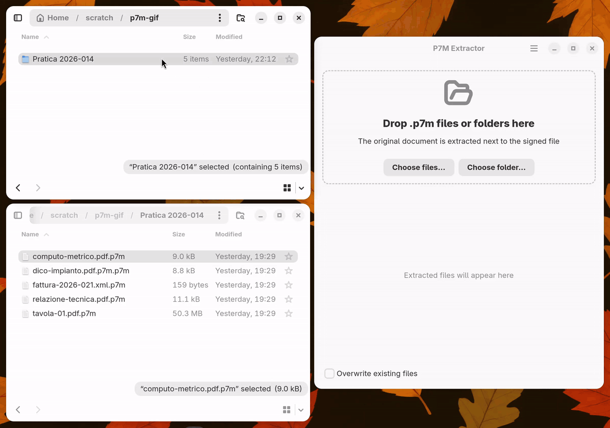
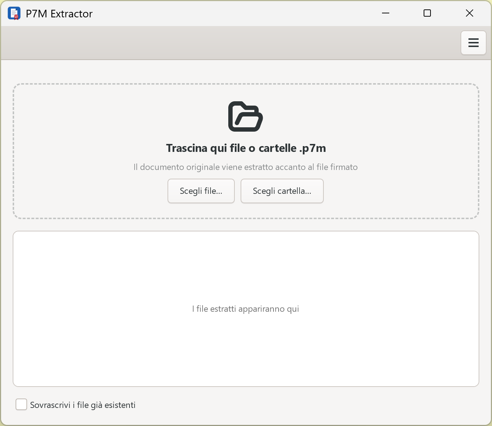
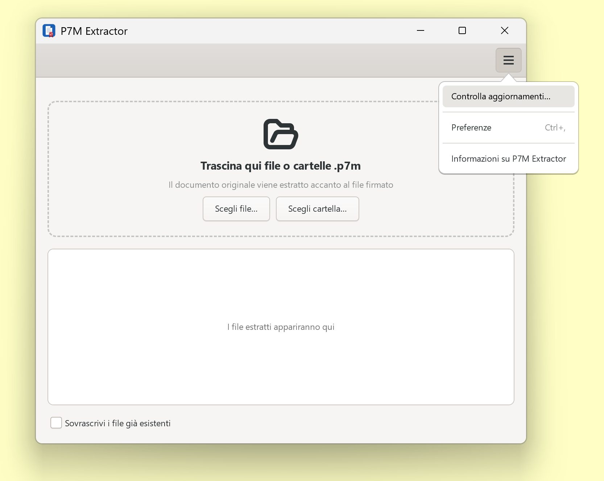
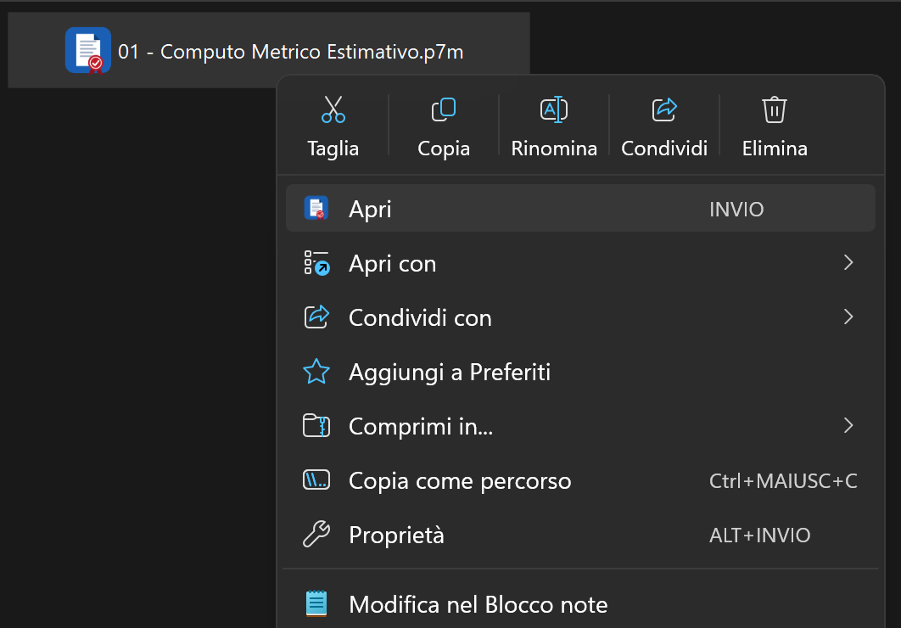

<p align="center">
  
</p>

<h1 align="center">P7M Extractor</h1>

<p align="center">
  Extract the original document from CAdES <code>.p7m</code> digitally signed files.
</p>

<p align="center">
  <a href="https://github.com/daniel-g-carrasco/p7m-extractor/actions/workflows/build.yml">
    
  </a>
  <a href="LICENSE"></a>
</p>

The `.p7m` format is used across Italy for signed drawings, contracts,
PEC attachments and electronic invoices (Fattura Elettronica). It wraps the
original document (PDF, XML, …) in a PKCS#7/CMS signature envelope; this tool
unwraps it.

Drag & drop GUI (GTK 4 / libadwaita) + CLI, installable or portable on
**Windows**, Flatpak or portable on **Linux**. No third-party Python packages:
the PKCS#7/CMS envelope is parsed directly by a small pure-Python BER parser. The extracted
file is **byte-for-byte identical** to what was signed.

<p align="center">
  
</p>

## Download

Grab a build from the
[**Releases**](https://github.com/daniel-g-carrasco/p7m-extractor/releases) page:

| Platform | File | Notes |
|---|---|---|
| Windows installer | `p7m-extractor-setup-*-windows-x64.exe` | Start menu entry, uninstaller, `.p7m` file association and Explorer context menu (both optional), built-in update check |
| Windows portable | `p7m-extractor-*-windows-x64-portable.zip` | unzip anywhere, run `p7m-extractor.exe` — no installation, no admin rights; Explorer integration can be enabled from *Preferenze* |
| Linux Flatpak | [our repository](https://daniel-g-carrasco.github.io/p7m-extractor/) | `flatpak install https://daniel-g-carrasco.github.io/p7m-extractor/p7m-extractor.flatpakref`, updates arrive through GNOME Software; a `.flatpak` bundle is attached to every release too |
| Linux portable | `p7m-extractor-*-linux-x64-portable.tar.gz` | untar, run `./p7m-extractor` |

Everything (GTK included) ships inside the Windows and portable packages.
The installer defaults to a per-user install, so no administrator rights are
needed there either.

## Run from source

Only Python ≥ 3.9, PyGObject/GTK 4 and libadwaita 1.5 or newer are needed,
all packaged on every distribution. libadwaita is optional: without it the GUI
falls back to plain GTK 4.

```bash
# Debian/Ubuntu          # Fedora                          # Arch
sudo apt install python3-gi gir1.2-gtk-4.0 gir1.2-adw-1
                         sudo dnf install python3-gobject gtk4 libadwaita
                                                           sudo pacman -S python-gobject gtk4 libadwaita
python3 p7m_extractor.py
```

On Windows, use a release build or MSYS2
(`pacman -S mingw-w64-x86_64-gtk4 mingw-w64-x86_64-python-gobject`).

## CLI

The same executable works headless when given arguments
(the CLI core is pure stdlib — it runs even without GTK installed):

```bash
p7m-extractor invoice.xml.p7m                 # single file
p7m-extractor --overwrite projects/           # whole folder, recursive
p7m-extractor a.pdf.p7m b.pdf.p7m c.xml.p7m   # batch
p7m-extractor --check-update                  # print the latest release
p7m-extractor --register | --unregister       # Windows: Explorer integration
```

Exit code is non-zero if any file failed. Existing outputs are skipped unless
`--overwrite` is given.

## Features

- **Drag & drop** files *or folders* (folders are scanned recursively)
- **Batch**: hundreds of files in one go, every file listed at once with its
  state (queued, extracting with progress, done); double-click a finished
  row to open the document, or use its folder button to reveal it
- **Single window**: opening more files (double-click, context menu, several
  files selected at once) adds them to the window already open
- **Nested signatures** (`doc.pdf.p7m.p7m`) unwrapped in a single pass
- **Binary and base64/PEM** `.p7m` containers auto-detected
- **BER streaming** (indefinite-length, chunked content) fully supported —
  the encoding used by common Italian signing tools
- Output is written next to the source file, never modifying the original
- **Light / dark theme** following the system (Windows personalization
  setting, freedesktop settings portal on Linux), or forced from *Preferences*
- **English and Italian** UI, following the desktop language (or forced from
  *Preferences*); the Windows installer is bilingual too and hands its
  language choice over to the app

### Windows integration

<p align="center">
  
  
</p>

- **Double-click** a `.p7m` to extract it on the spot (file association):
  the file lands in the window's list as *In coda*, then shows its
  extraction progress (read and write, useful on network shares) and the
  outcome. Further files join the queue in the same window.
- The main menu opens with F10 (GTK convention) or a tap on Alt (Windows
  habit); another tap on Alt closes it.
- **Context menu**: right-click one or more `.p7m` files →
  *Estrai il contenuto con P7M Extractor*. On Windows 11 the entry lives
  under *Mostra altre opzioni* (Shift+F10), like every classic shell verb.
- **Default app prompt**: at start-up the app offers to become the default
  handler for `.p7m` (buttons *Imposta come predefinita* / *Non ora*, plus
  *Non chiedere più*). Since Windows 10 an app cannot override a default the
  user already chose, so in that case the app opens the *Default apps* page
  of Settings directly on its own entry.
- **Updates**: menu → *Controlla aggiornamenti…*, plus an automatic daily
  check (can be turned off in *Preferenze*). Installed builds download the
  new installer and launch it; the portable build is sent to the release page.
- Everything above is per-user (`HKEY_CURRENT_USER`), also for the portable
  build; *Preferenze* → *Rimuovi* takes it all away, as does the uninstaller.
- **Native window decorations** by default: the system title bar (dark when
  the theme is dark) handles moving, snapping and restoring from maximized,
  which GTK's own decorations get wrong on Windows. *Preferenze* switches
  back to GTK's header bar.

<p align="center">
  
</p>

### Linux

- A libadwaita application: current GNOME look, `AdwStyleManager` follows the
  system light/dark preference on its own, `AdwAboutDialog` and
  `AdwPreferencesDialog` for the secondary windows.
- Registers as a handler for `application/pkcs7-mime` through its desktop
  entry, so it shows up in *Open With* and can be set as default from the
  file manager — no in-app prompt, as the GNOME HIG prescribes.
- No self-updater: updates come from Flatpak / the distribution, and the
  release notes are shipped as AppStream metadata for GNOME Software.

## Why not just `openssl smime`?

Two traps that this tool exists to avoid:

1. `openssl smime` chokes on BER indefinite-length encoding
   (`asn1 encoding routines:wrong tag`) — many Italian `.p7m` use it.
2. `openssl cms -verify` **without `-binary` silently corrupts binary
   content** by converting line endings (LF → CRLF): the extracted PDF grows
   by a few KB, its cross-reference offsets shift, and strict viewers
   (e.g. Nitro PDF) refuse to open it.

If you prefer OpenSSL, the correct incantation is:

```bash
openssl cms -verify -noverify -binary -inform DER -in file.pdf.p7m -out file.pdf
```

P7M Extractor sidesteps both problems by parsing the envelope itself and
copying the embedded octets verbatim.

> **Note on legal validity** — this tool *extracts* the signed content; it
> does **not** validate certificates, trust chains or revocation. For legally
> meaningful verification use a qualified service (GoSign, ArubaSign, the
> AgID-accredited online verifiers).

## Flatpak

The app is published in its own Flatpak repository, served from GitHub Pages
and signed with the key `CD01 04C4 EBDE 041D 4B63 E635 9240 718A F4C3 3BD2`;
the GNOME runtime comes from Flathub. Install once, updates follow:

```bash
flatpak install https://daniel-g-carrasco.github.io/p7m-extractor/p7m-extractor.flatpakref
```

Every `v*` tag is published there by CI
([flatpak-repo.yml](.github/workflows/flatpak-repo.yml)). To build locally
instead:

```bash
flatpak install flathub org.gnome.Platform//50 org.gnome.Sdk//50
flatpak-builder --user --install --force-clean build-dir \
    build-aux/flatpak/io.github.daniel_g_carrasco.p7m-extractor.yaml
flatpak run io.github.daniel_g_carrasco.p7m-extractor
```

The manifest ([build-aux/flatpak/](build-aux/flatpak/)) installs the script,
the desktop entry, the AppStream metainfo and the icons from
[data/](data/). CI builds a `.flatpak` bundle for every push and attaches it
to releases. The app needs `--filesystem=host` because the extracted file is
written next to the signed one, wherever that is.

The app ID `io.github.daniel_g_carrasco.p7m-extractor` is derived from the
GitHub repository, so Flathub verifies ownership through the GitHub account
and no domain is involved. Submitting needs, in addition: a screenshot at
`data/screenshots/main-window.png` (referenced by the metainfo at the
release tag) and a copy of the manifest with a `type: git` source pinned to
the release tag.

The [site/](site/) folder is the project page, https://p7m.neistar.com,
deployed with Cloudflare Pages (repository connected, no build command,
output directory `site`).

## Development

```bash
python tests/test_extract.py     # self-contained test suite, no deps
python tools/compile_po.py       # compile po/*.po into locale/ (needed to see translations)
python tools/make_icon.py        # regenerate assets/icon.*, data/icons PNGs, installer bitmaps (Pillow)
desktop-file-validate data/io.github.daniel_g_carrasco.p7m-extractor.desktop
appstreamcli validate --no-net data/io.github.daniel_g_carrasco.p7m-extractor.metainfo.xml
```

Builds are produced by [CI](.github/workflows/build.yml) (PyInstaller;
MSYS2 on Windows; installer compiled with Inno Setup; Flatpak via
flatpak-builder). Tagging `v*` publishes a release; the tag must match
`__version__` in `p7m_extractor.py`, and the release should be listed in
the metainfo. Most of the package size is the bundled GTK stack; CI strips
unused locales and icon-theme variants to keep it in check.

Preferences are stored in `%LOCALAPPDATA%\p7m-extractor\settings.ini` on
Windows and `$XDG_CONFIG_HOME/p7m-extractor/settings.ini` on Linux.

Translations live in `po/` (English source strings in the code, one `.po`
per language). To refresh the template after changing strings:
`xgettext --from-code=UTF-8 --keyword=_ -o po/p7m-extractor.pot p7m_extractor.py`,
then merge with `msgmerge -U po/it.po po/p7m-extractor.pot`.
Set `P7M_STARTUP_LOG=<file>` to get start-up timestamps appended to a file
(profiling aid).

## License

[MIT](LICENSE) © Daniel Grasso
